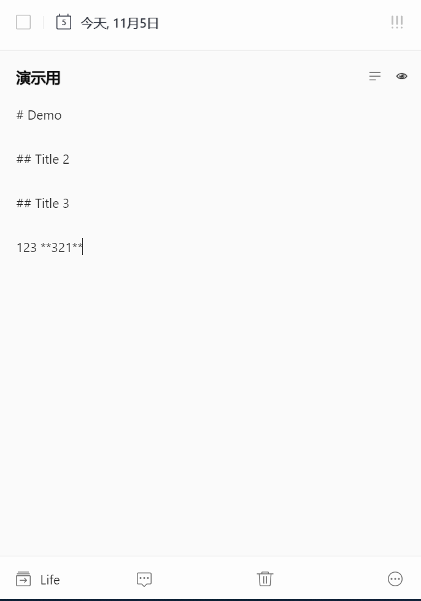
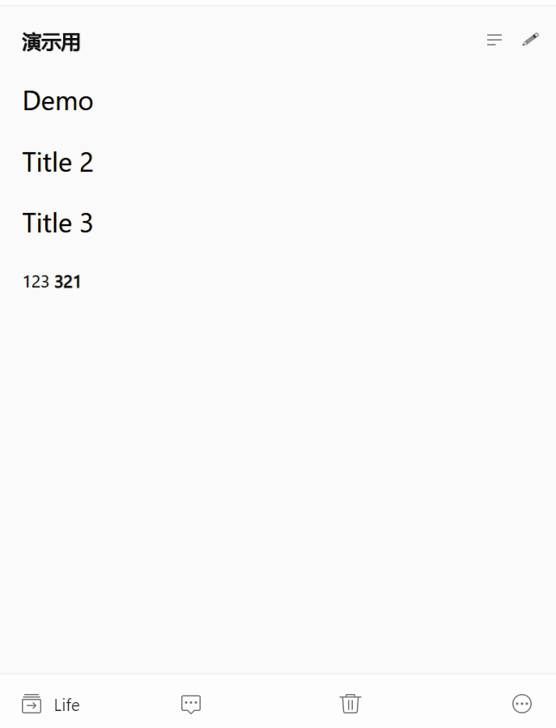

# TickTickMarkdown

 

请共同参与抵抗 996 工作制, 祝所有 996 公司早日破产

## LICENSE

[-blue.svg)](https://github.com/996icu/996.ICU/blob/master/LICENSE)
请共同参与抵抗 996 工作制, 祝所有 996 公司早日破产

## DESC

>Tampermonkey 插件: 让**滴答清单** Chrome 插件实现 Markdown 支持 

>Thanks to: [dankeder/ticktick-markdown](https://github.com/dankeder/ticktick-markdown/blob/master/TickTickMarkdown.user.js)

## 使用效果
使用指导: [http://szhshp.org/dev/2018/11/05/markdownsupportfordidalist.html](http://szhshp.org/dev/2018/11/05/markdownsupportfordidalist.html)

-----

-----

-----

## Update History

- 2019.03.06: 滴答官方修改了网页端布局, 原本的版本不通用了, 修改了预览部分的实现逻辑

## URL Match Pattern

对于普通版, 不用对代码进行修改

对于国际版, 请将 `@match` 地址改成 `https://ticktick.com/`

## How to use

1. Install the [Tampermonkey](http://tampermonkey.net/) browser add-on.

2. Add the script `TickTickMarkdown.user.js` to Tampermonkey.

### Hotkey

F4 切换 Edit/Preview 模式.

## Licence

MIT
